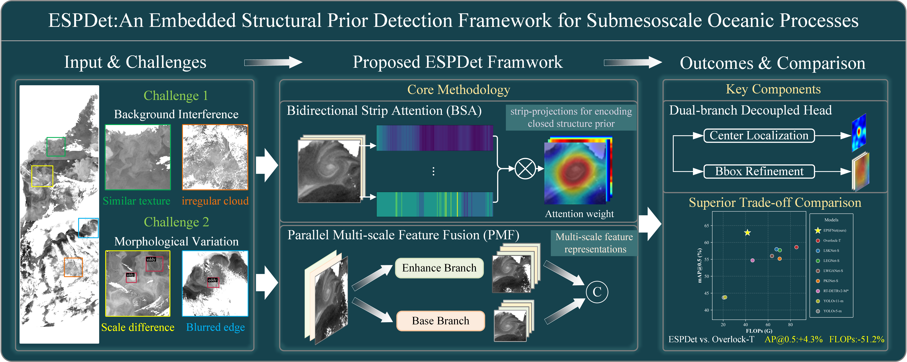

<div align="center">
   <div>&nbsp;</div>
  <div align="center">
    <b><font size="5">ESPDet Official Implementation</font></b>
  </div>
  <div>&nbsp;</div>

[](https://github.com/RSODL/ESPDet/blob/main/LICENSE)
[](https://pytorch.org/get-started/locally/)
[](https://github.com/RSODL/ESPDet/pulls)

[💡 Introduction](#-introduction) | [🛠️Installation](#-installation) | [👀Model Zoo](#overview-of-benchmark) | [🤔Reporting Issues](https://github.com/RSODL/ESPDet/issues)

</div>

---

## 💡 Introduction

**ESPDet** is a submesoscale oceanic process (SOP) detection framework that incorporates intrinsic structural priors into deep learning architectures. By establishing a structure-aware detection paradigm, this work provides a robust and physics-informed tool for resolving fine-scale oceanic structures in vast satellite images.

### ✨ Major Features
- **Task-Specific Design**: It is important to note that **ESPDet** is a specialized framework purpose-built for **Submesoscale Oceanic Processes (SOPs)** rather than generic object detection. By deeply integrating the intrinsic structural and topological priors of submesoscale features such as topological closure and continuity that are seldom found in common terrestrial objects—ESPDet achieves superior fidelity and robustness in complex marine environments where general-purpose detectors often struggle.
---

## 🆕 What's New
- **[2026/03]** ESPDet code is officially released!

---

## 📦 Resources & Data
- **Model Weights & Logs**: trained weights and detailed training logs are available at [Baidu Netdisk (Link)](https://pan.baidu.com/s/1jniOQEKYm45HAmPvcGESdQ?pwd=srxr) (Password: `srxr`).
- **Dataset Status**: We are currently preparing a comprehensive version of the SOP dataset for open access. While the full dataset is under a staged release process to meet data-sharing protocols, we provide sample images in the demo/ folder for initial testing and verification. The entire repository will be released.
  
---

## 🛠️ Installation

### Requirements
- Python 3.8+
- PyTorch 1.8+
- CUDA 11.0+

### Step-by-step Installation
```bash
# Clone the repository
git clone https://github.com/RSODL/ESPDet.git
cd ESPDet

# Create a conda environment
conda create -n espdet python=3.8 -y
conda activate espdet

# Install dependencies
pip install -r requirements.txt
```

---

## 🚀 Getting Started
1. Data Preparation
Please organize your SOP dataset (e.g., SAR or Optical imagery) following the COCO-style structure:
```text
data/SOP_dataset/
├── images/
│   ├── train/
│   └── test/
└── annotations/
    ├── train.json
    └── test.json
```
2. Training
To train ESPDet on a single GPU (or multiple GPUs), run:
```bash
python tools/train.py [config file]
```
3. Evaluation
```bash
python tools/test.py [config file] [checkpoint file]
```

<div align="left">

>[! IMPORTANT]
Note: For general issues regarding the underlying engine (e.g., installation errors of MMCV or training hooks), please refer to the MMDetection official tutorials found in the docs/ directory (specifically the README.md and get_started.md files).

</div>

---

## 📂 Project Structure
<details open>
<summary>View Folder Hierarchy</summary>

```text
ESPDet/
├── configs/          # Configuration files
├── mmdet/           # Implementation of PMF, BSA, and Decoupled Head
├── demo/             # some image example 
├── tools/            # Training, testing, and utility scripts
├── utils/            # Shared helper functions
├── resources/        # Figures and logos
└── requirements.txt  # Environment dependencies
```
</details>

---

## 🤝 Acknowledgement
This project is developed based on the MMDetection toolbox. We would like to thank the OpenMMLab team for their excellent work.

---

## 📜 Citation

---

## 📄 License
This project is released under the Apache 2.0 license.

<div align="center">
<b>Thanks for your interest in ESPDet!</b>
</div>


